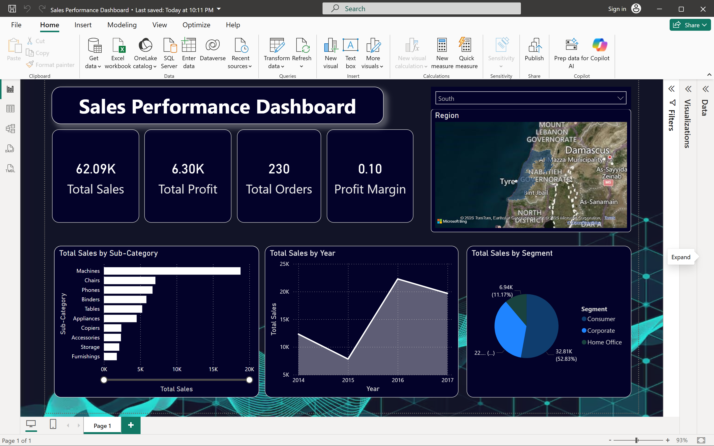

# 📊 Sales Insights & Profit Analysis Dashboard

> An interactive **Power BI dashboard** designed to analyze sales performance, profitability, and customer behavior using data-driven insights.

---

## 🚀 Overview

The **Sales Insights Dashboard** provides a comprehensive view of business performance through visually rich and interactive reports. It enables users to explore trends, identify high-performing areas, and make informed decisions.. 

---

## 🎯 Objectives

- 📌 Monitor overall sales and profit performance  
- 📈 Analyze year-wise sales trends  
- 🛍️ Identify top-performing product sub-categories  
- 👥 Understand customer segmentation  
- 🌍 Evaluate regional sales distribution  

---

## 📂 Dataset Details

| Attribute | Description |
|----------|------------|
| Dataset Name | Superstore Sales Dataset |
| Source | https://github.com/plotly/datasets/blob/master/superstore.csv |
| Format | CSV |
| Type | Structured transactional data |

---

## 🛠️ Tools & Technologies

- **Power BI** – Dashboard creation & visualization  
- **Power Query** – Data cleaning & transformation  
- **DAX** – Measures & calculated fields  

---

## 📊 Dashboard Features

### 🔹 Key Metrics (KPIs)

- 💰 **Total Sales:** 62.09K  
- 📊 **Total Profit:** 6.30K  
- 📦 **Total Orders:** 230  
- 📉 **Profit Margin:** 10%  

---

### 🔹 Visual Insights

- 📈 **Sales Trend (Year-wise)**  
  → Tracks performance fluctuations over time  

- 📊 **Sales by Sub-Category**  
  → Highlights best & worst performing products  

- 🥧 **Sales by Segment**  
  → Consumer dominates overall contribution  

- 🗺️ **Regional Sales Map**  
  → Shows geographic distribution of sales  

---

## 💡 Key Insights

- 🔝 Machines & Chairs generate the highest revenue  
- 📊 Peak sales observed in **2016**, slight drop afterward  
- 👥 Consumer segment contributes the most  
- 🌍 Regional gaps indicate expansion opportunities  

---

## 🧹 Data Preparation Steps

- Removed missing and inconsistent values  
- Standardized column names and formats  
- Created DAX measures:
  - Total Sales  
  - Total Profit  
  - Order Count  
  - Profit Margin  

---

## 📸 Dashboard Preview



---

## 🔮 Future Improvements

- 🔄 Add dynamic slicers for better interactivity  
- 📊 Implement YoY & MoM growth analysis  
- 🎨 Enhance UI with custom themes  
- 🔍 Enable drill-through & advanced tooltips  

---

## 📁 Project Structure

```
📦 sales-insights-dashboard
 ┣ 📂 data
 ┃ ┣ raw_dataset.csv
 ┃ ┗ cleaned_dataset.csv
 ┣ 📂 screenshots
 ┃ ┗ dashboard.png
 ┣ 📄 Sales_Dashboard.pbix
 ┗ 📄 README.md
```

---

## 🤝 Contributing

Contributions are welcome!

1. Fork the repository  
2. Create a new branch  
3. Make your changes  
4. Submit a Pull Request  

---

## 📜 License

This project is licensed under the **MIT License**.

---

## ⭐ Support

If you found this project helpful, consider giving it a ⭐ on GitHub!
